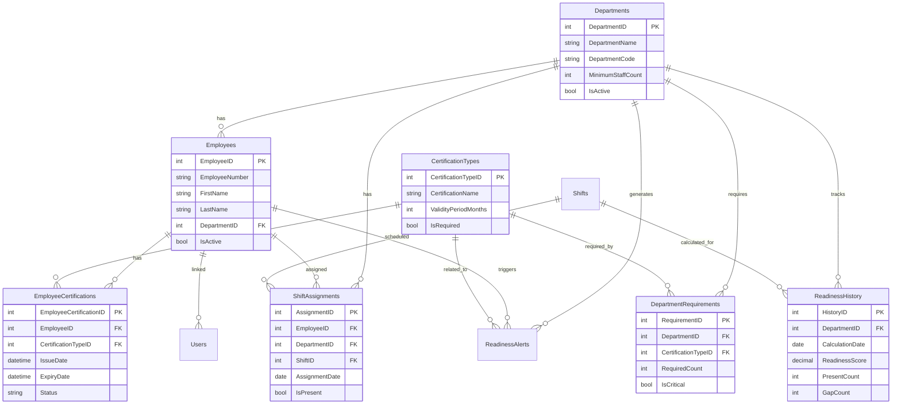

# ארכיטקטורה ותשתית - ComplianceCenter

## תוכן עניינים
1. [סקירה כללית](#סקירה-כללית)
2. [מבנה שכבות](#מבנה-שכבות)
3. [תרשים ארכיטקטורה](#תרשים-ארכיטקטורה)
4. [מבנה מסד נתונים](#מבנה-מסד-נתונים)
5. [תרשים ERD](#תרשים-erd)
6. [לוגיקת עסקים](#לוגיקת-עסקים)
7. [תהליכי עבודה](#תהליכי-עבודה)
8. [Stored Procedures](#stored-procedures)
9. [מצב יישום](#מצב-יישום)

---

## סקירה כללית

ComplianceCenter בנויה על **3-Tier Architecture** המפרידה בין:
- **Presentation Layer**: ASP.NET Web Forms
- **Business Logic Layer**: Managers ו-Services
- **Data Access Layer**: Entity Framework עם SQL Server

המערכת משתמשת ב-**Entity Framework 6** עם **Code-First** (EDMX) לגישה לנתונים, וב-**Stored Procedures** לחישובים מורכבים.

---

## מבנה שכבות

### 1. Presentation Layer (`ComplianceCenter`)

**תפקיד**: ממשק המשתמש והאינטראקציה עם המשתמש.

**מבנה**:
```
ComplianceCenter/
├── Pages/              # דפי המערכת
│   ├── Dashboard.aspx           # דשבורד מרכזי
│   ├── DepartmentDetails.aspx    # פרטי מחלקה
│   ├── EmployeeProfile.aspx      # פרופיל עובד
│   └── Replacements.aspx       # המלצות להחלפת עובד
├── Account/            # ניהול משתמשים
│   └── Login.aspx               # התחברות
├── Controls/           # User Controls
│   └── SmartCertUpload.ascx     # העלאת הסמכות
└── Models/             # Identity Models
```

**תכונות**:
- Page Lifecycle מלא עם ViewState
- Validation Forms עם RequiredFieldValidator
- GridView ו-Repeater להצגת נתונים
- User Controls לשימוש חוזר
- AJAX עם UpdatePanel
- Session Management

### 2. Business Logic Layer (`ComplianceCenter.BLL`)

**תפקיד**: לוגיקת עסקים, חישובים, ושירותים.

**מבנה**:
```
ComplianceCenter.BLL/
├── Managers/           # ניהול ישויות
│   ├── DepartmentManager.cs      # ניהול מחלקות
│   ├── EmployeeManager.cs        # ניהול עובדים
│   ├── CertificationManager.cs   # ניהול הסמכות
│   └── ShiftManager.cs           # ניהול משמרות
├── Services/           # שירותים
│   ├── ReadinessCalculator.cs    # חישוב כשירות
│   ├── RecommendationEngine.cs   # המלצות AI
│   ├── AIAnalysisService.cs      # ניתוח AI
│   ├── EmailService.cs           # שליחת מיילים
│   ├── SMSService.cs             # שליחת SMS
│   └── SchedulerService.cs      # משימות מתוזמנות
├── DTO/               # Data Transfer Objects
│   ├── DepartmentGap.cs
│   ├── CertificationStatistics.cs
│   └── TrainingPriority.cs
└── Helpers/           # עזרים
    ├── ExcelExporter.cs
    ├── PdfGenerator.cs
    └── SecurityHelper.cs
```

**תכונות**:
- הפרדת אחריות (Separation of Concerns)
- Dependency Injection (בסיסי)
- חישובים מורכבים
- אינטגרציה עם שירותים חיצוניים

### 3. Data Access Layer (`ComplianceCenter.DAL`)

**תפקיד**: גישה לנתונים וממשק למסד הנתונים.

**מבנה**:
```
ComplianceCenter.DAL/
├── ComplianceCenterModel.edmx    # Entity Framework Model
├── ComplianceCenterModel.Context.cs
├── Department.cs                 # Entity Classes
├── Employee.cs
├── EmployeeCertification.cs
├── CertificationType.cs
├── Shift.cs
├── ShiftAssignment.cs
└── [Result Classes]              # Stored Procedure Results
```

**תכונות**:
- Entity Framework 6 עם EDMX
- Stored Procedures לחישובים מורכבים
- Lazy Loading
- Change Tracking

---


## מבנה מסד נתונים

### טבלאות מרכזיות

#### 1. Departments (מחלקות)
```sql
CREATE TABLE Departments (
    DepartmentID INT PRIMARY KEY IDENTITY(1,1),
    DepartmentName NVARCHAR(100) NOT NULL,
    DepartmentCode NVARCHAR(20) NOT NULL,
    Description NVARCHAR(500),
    ManagerEmployeeID INT,
    MinimumStaffCount INT NOT NULL DEFAULT 1,
    IsActive BIT NOT NULL DEFAULT 1,
    CreatedDate DATETIME NOT NULL DEFAULT GETDATE(),
    ModifiedDate DATETIME
);
```

#### 2. Employees (עובדים)
```sql
CREATE TABLE Employees (
    EmployeeID INT PRIMARY KEY IDENTITY(1,1),
    EmployeeNumber NVARCHAR(50) NOT NULL UNIQUE,
    FirstName NVARCHAR(50) NOT NULL,
    LastName NVARCHAR(50) NOT NULL,
    Email NVARCHAR(100),
    PhoneNumber NVARCHAR(20),
    DepartmentID INT NOT NULL,
    PositionTitle NVARCHAR(100),
    HireDate DATETIME NOT NULL,
    TerminationDate DATETIME,
    IsActive BIT NOT NULL DEFAULT 1,
    PhotoFileName NVARCHAR(255),
    CreatedDate DATETIME NOT NULL DEFAULT GETDATE(),
    ModifiedDate DATETIME,
    FOREIGN KEY (DepartmentID) REFERENCES Departments(DepartmentID)
);
```

#### 3. CertificationTypes (סוגי הסמכות)
```sql
CREATE TABLE CertificationTypes (
    CertificationTypeID INT PRIMARY KEY IDENTITY(1,1),
    CertificationName NVARCHAR(100) NOT NULL,
    CertificationCode NVARCHAR(20) NOT NULL,
    Description NVARCHAR(500),
    ValidityPeriodMonths INT,
    IsRequired BIT NOT NULL DEFAULT 0,
    IsActive BIT NOT NULL DEFAULT 1,
    CreatedDate DATETIME NOT NULL DEFAULT GETDATE(),
    ModifiedDate DATETIME
);
```

#### 4. EmployeeCertifications (הסמכות עובדים)
```sql
CREATE TABLE EmployeeCertifications (
    EmployeeCertificationID INT PRIMARY KEY IDENTITY(1,1),
    EmployeeID INT NOT NULL,
    CertificationTypeID INT NOT NULL,
    CertificateNumber NVARCHAR(100),
    IssueDate DATETIME NOT NULL,
    ExpiryDate DATETIME NOT NULL,
    Status NVARCHAR(20) NOT NULL DEFAULT 'Active',
    CertificateFileName NVARCHAR(255),
    Notes NVARCHAR(1000),
    CreatedDate DATETIME NOT NULL DEFAULT GETDATE(),
    ModifiedDate DATETIME,
    FOREIGN KEY (EmployeeID) REFERENCES Employees(EmployeeID),
    FOREIGN KEY (CertificationTypeID) REFERENCES CertificationTypes(CertificationTypeID)
);
```

#### 5. DepartmentRequirements (דרישות מחלקה)
```sql
CREATE TABLE DepartmentRequirements (
    RequirementID INT PRIMARY KEY IDENTITY(1,1),
    DepartmentID INT NOT NULL,
    CertificationTypeID INT NOT NULL,
    RequiredCount INT NOT NULL DEFAULT 1,
    IsCritical BIT NOT NULL DEFAULT 0,
    Notes NVARCHAR(500),
    CreatedDate DATETIME NOT NULL DEFAULT GETDATE(),
    ModifiedDate DATETIME,
    FOREIGN KEY (DepartmentID) REFERENCES Departments(DepartmentID),
    FOREIGN KEY (CertificationTypeID) REFERENCES CertificationTypes(CertificationTypeID)
);
```

#### 6. Shifts (משמרות)
```sql
CREATE TABLE Shifts (
    ShiftID INT PRIMARY KEY IDENTITY(1,1),
    ShiftName NVARCHAR(50) NOT NULL,
    ShiftCode NVARCHAR(10) NOT NULL,
    StartTime TIME NOT NULL,
    EndTime TIME NOT NULL,
    IsActive BIT NOT NULL DEFAULT 1,
    CreatedDate DATETIME NOT NULL DEFAULT GETDATE(),
    ModifiedDate DATETIME
);
```

#### 7. ShiftAssignments (הקצאות משמרת)
```sql
CREATE TABLE ShiftAssignments (
    AssignmentID INT PRIMARY KEY IDENTITY(1,1),
    EmployeeID INT NOT NULL,
    DepartmentID INT NOT NULL,
    ShiftID INT NOT NULL,
    AssignmentDate DATE NOT NULL,
    IsPresent BIT NOT NULL DEFAULT 0,
    Notes NVARCHAR(500),
    CreatedDate DATETIME NOT NULL DEFAULT GETDATE(),
    ModifiedDate DATETIME,
    FOREIGN KEY (EmployeeID) REFERENCES Employees(EmployeeID),
    FOREIGN KEY (DepartmentID) REFERENCES Departments(DepartmentID),
    FOREIGN KEY (ShiftID) REFERENCES Shifts(ShiftID)
);
```

#### 8. ReadinessAlerts (התראות כשירות)
```sql
CREATE TABLE ReadinessAlerts (
    AlertID INT PRIMARY KEY IDENTITY(1,1),
    DepartmentID INT NOT NULL,
    CertificationTypeID INT,
    EmployeeID INT,
    AlertType NVARCHAR(50) NOT NULL,
    Severity NVARCHAR(20) NOT NULL,
    Title NVARCHAR(200) NOT NULL,
    Description NVARCHAR(1000),
    IsResolved BIT NOT NULL DEFAULT 0,
    ResolvedDate DATETIME,
    CreatedDate DATETIME NOT NULL DEFAULT GETDATE(),
    ModifiedDate DATETIME,
    FOREIGN KEY (DepartmentID) REFERENCES Departments(DepartmentID),
    FOREIGN KEY (CertificationTypeID) REFERENCES CertificationTypes(CertificationTypeID),
    FOREIGN KEY (EmployeeID) REFERENCES Employees(EmployeeID)
);
```

#### 9. ReadinessHistory (היסטוריית כשירות)
```sql
CREATE TABLE ReadinessHistory (
    HistoryID INT PRIMARY KEY IDENTITY(1,1),
    DepartmentID INT NOT NULL,
    CalculationDate DATE NOT NULL,
    ShiftID INT,
    ReadinessScore DECIMAL(5,2) NOT NULL,
    PresentCount INT NOT NULL DEFAULT 0,
    RequiredCount INT NOT NULL DEFAULT 0,
    ReadyCount INT NOT NULL DEFAULT 0,
    GapCount INT NOT NULL DEFAULT 0,
    Notes NVARCHAR(500),
    CreatedDate DATETIME NOT NULL DEFAULT GETDATE(),
    FOREIGN KEY (DepartmentID) REFERENCES Departments(DepartmentID),
    FOREIGN KEY (ShiftID) REFERENCES Shifts(ShiftID)
);
```

---

## תרשים ERD



---

## לוגיקת עסקים

### 1. חישוב כשירות מחלקה

החישוב מתבצע ב-Stored Procedure `sp_CalculateDepartmentReadiness`:

**אלגוריתם**:
1. לכל דרישה במחלקה:
   - מצא עובדים עם הסמכה תקפה (`ExpiryDate > Date`)
   - בדוק נוכחות במשמרת (`IsPresent = 1`)
   - חשב כמה עובדים כשירים יש
2. חשב פער: `Gap = RequiredCount - ActualCompliant`
3. חשב ציון: `Score = (TotalCompliant / TotalRequired) * 100`
4. סווג לפי רמת קריטיות

**קוד** (DepartmentManager.cs):
```csharp
public DepartmentReadinessResult GetDepartmentReadiness(int departmentId, DateTime? date = null, int? shiftId = null)
{
    var results = _context.sp_CalculateDepartmentReadiness(departmentId, date, shiftId);
    return results.FirstOrDefault();
}
```

### 2. זיהוי פערים קריטיים

פער נחשב קריטי אם:
- `IsCritical = 1` ב-DepartmentRequirements
- `Gap > 0` (חסרים עובדים)
- `ExpiryDate < Date + 30` (תפוגה תוך 30 יום)

**קוד** (DepartmentManager.cs):
```csharp
public List<DepartmentGap> GetDepartmentGaps(int departmentId, DateTime? date = null)
{
    // Query מורכב המחשב פערים
    // ...
}
```

### 3. המלצות AI למחליפים

המערכת משתמשת ב-Stored Procedure `sp_GetReplacementSuggestions`:

**קריטריונים**:
1. עובד עם הסמכה נדרשת
2. הסמכה תקפה (`ExpiryDate > Date`)
3. עובד פעיל (`IsActive = 1`)
4. זמינות במשמרת (`IsPresent = 0` או לא מוקצה)
5. מיון לפי:
   - מספר הסמכות רלוונטיות
   - תאריך תפוגה (מאוחר יותר = עדיף)
   - ניסיון במחלקה

**קוד** (RecommendationEngine.cs):
```csharp
public List<ReplacementSuggestionResult> SuggestReplacements(
    int departmentId, 
    int certificationTypeId, 
    int? shiftID, 
    DateTime? date = null)
{
    return _context.sp_GetReplacementSuggestions(
        departmentId, 
        certificationTypeId, 
        date, 
        shiftID, 
        10).ToList();
}
```

### 4. חיזוי פערים עתידיים

המערכת משתמשת ב-`sp_PredictFutureGaps`:

**אלגוריתם**:
1. מצא הסמכות שפוקעות ב-30 יום הקרובים
2. חשב כמה עובדים יאבדו כשירות
3. השווה לדרישות המחלקה
4. צפה פערים עתידיים

---


## Stored Procedures

### 1. sp_CalculateDepartmentReadiness

**תפקיד**: חישוב ציון כשירות מחלקה.

**פרמטרים**:
- `@DepartmentID INT`
- `@Date DATE` (אופציונלי, ברירת מחדל: היום)
- `@ShiftID INT` (אופציונלי)

**תוצאה**: `DepartmentReadinessResult`

**לוגיקה**:
1. מצא דרישות מחלקה
2. חשב עובדים כשירים (עם הסמכה תקפה ונוכחים)
3. חשב פערים לפי רמת קריטיות
4. חשב ציון משוקלל

### 2. sp_GetReplacementSuggestions

**תפקיד**: המלצות למחליפים.

**פרמטרים**:
- `@DepartmentID INT`
- `@RequiredCertificationTypeID INT`
- `@Date DATE`
- `@ShiftID INT` (אופציונלי)
- `@MaxResults INT`

**תוצאה**: `List<ReplacementSuggestionResult>`

**לוגיקה**:
1. מצא עובדים עם הסמכה נדרשת
2. בדוק זמינות
3. חשב ציון התאמה
4. מיין לפי ציון

### 3. sp_PredictFutureGaps

**תפקיד**: חיזוי פערים עתידיים.

**פרמטרים**:
- `@DepartmentID INT` (אופציונלי)
- `@DaysAhead INT` (ברירת מחדל: 30)

**תוצאה**: `List<FutureGapResult>`

**לוגיקה**:
1. מצא הסמכות שפוקעות ב-`@DaysAhead` ימים
2. חשב כמה עובדים יאבדו כשירות
3. השווה לדרישות
4. צפה פערים

### 4. sp_CalculateDepartmentGaps

**תפקיד**: חישוב פערים ספציפיים.

**פרמטרים**:
- `@DepartmentID INT`
- `@Date DATE`
- `@ShiftID INT` (אופציונלי)

**תוצאה**: `List<DepartmentGapsResult>`

---

## מצב יישום

### ✅ ממומש במלואו

1. **Dashboard מרכזי**
   - KPIs (ציון כללי, פערים, התראות)
   - מפת חום של מחלקות
   - גרפים (מגמות, התפלגות)

2. **דף מחלקה**
   - כשירות מחלקה
   - רשימת עובדים
   - פערים קריטיים
   - היסטוריה

3. **פרופיל עובד**
   - מידע בסיסי
   - רשימת הסמכות
   - משמרות
   - סטטיסטיקות

4. **חישוב כשירות**
   - Stored Procedures
   - חישוב אוטומטי
   - מעקב היסטוריה

5. **העלאת קבצים**
   - SmartCertUpload Control
   - בדיקת סוג קובץ
   - Preview

### ⚠️ חלקי / בתהליך

1. **מערכת התראות**
   - ✅ יצירת התראות
   - ⚠️ שליחת Email (בסיסי)
   - ⚠️ שליחת SMS (לא ממומש)

2. **AI Recommendations**
   - ✅ המלצות בסיסיות
   - ⚠️ ניתוח מתקדם (ניתן להרחבה)

3. **Export**
   - ⚠️ Export ל-Excel (בסיסי)
   - ⚠️ Export ל-PDF (בסיסי)

4. **Logging**
   - ✅ לוגים בסיסיים
   - ⚠️ מעקב מתקדם

### 📋 לא ממומש (לעתיד)

1. **מצב Offline**
   - עבודה ללא אינטרנט
   - סנכרון אוטומטי

2. **Import מ-Excel**
   - ייבוא עובדים
   - ייבוא הסמכות

3. **Microservices**
   - API נפרד
   - שירותים עצמאיים

4. **Dashboard מותאם אישית**
   - ווידג'טים מותאמים
   - פריסה אישית

---

## הערות חשובות

### 1. Entity Framework
- המערכת משתמשת ב-EDMX (Database-First)
- עדכון Model: לחץ ימין על `.edmx` > Update Model from Database

### 2. Stored Procedures
- כל החישובים המורכבים ב-Stored Procedures
- תוצאות מוחזרות כ-Result Classes

### 3. Session Management
- Session משמש לאחסון UserID ו-UserName
- בדיקת אימות: `if (Session["UserID"] == null)`

### 4. File Uploads
- קבצים נשמרים ב-`~/Uploads/`
- גודל מקסימלי: 5MB (ניתן לשנות ב-Web.config)

### 5. Security
- ASP.NET Identity לאימות
- Windows Authentication למסד נתונים
- XSRF Protection ב-Site.Master

---

**עדכון אחרון**: 2025-01-03

